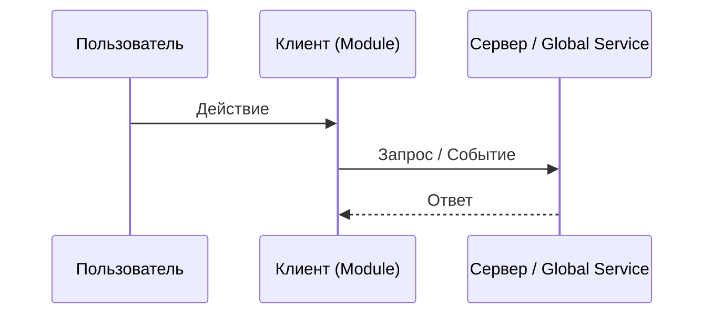

# Design Document: [Название задачи/модуля]

## Список затрагиваемых файлов
- [ ] `[MODIFY/NEW/DELETE] path/to/file1`
- [ ] `[MODIFY/NEW/DELETE] path/to/file2`

## Новые сущности и сигнатуры
### Классы / Интерфейсы
- `interface NewInterface { ... }`
- `class ValueObject { ... }` (всегда оборачивайте примитивы!)

### Методы и Функции
- `functionName(param: ValueObject): ReturnType`

## Логика взаимодействия и интерфейсы связи
[Опишите, как этот модуль связывается с остальным приложением. Какие события (Outputs/Inputs) используются, какие глобальные сервисы или API вызываются.]

## Схема взаимодействия (Mermaid-диаграмма)

